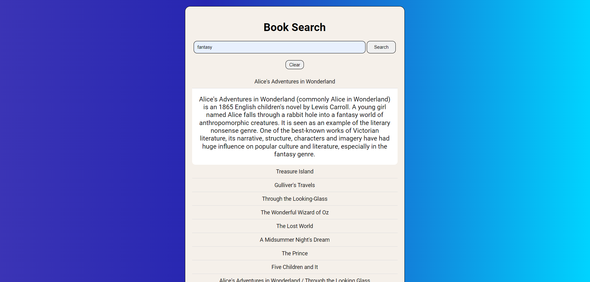

# Book Search App

This is a simple book search application that uses the OpenLibrary API. The app allows users to search for books by category and view detailed descriptions of each book. The application is built with Webpack and uses Lodash for data handling.
Here is the [Link](https://endearing-lollipop-cdbc87.netlify.app/)



## Table of Contents
- [Installation](#installation)
- [Features](#features)
- [Usage](#usage)
- [Notes](#notes)
- [Support](#support)
- [Credits](#credits)
- [License](#license)

## Installation
To install this app, follow these steps:

1. Clone this repository:
    ```bash
    git clone https://github.com/Pekko1/Book-search-app.git
    cd book-search-app
    ```
2. Install dependencies:
    ```bash
    npm install
    ```
3. build the application:
    ```bash
    npm run build
    ```
4. Start the application:
    ```bash
    npm start
    ```

## Features
- Search for books by category (e.g. science fiction, novels, non-fiction, etc.)
- Display a list of book titles related to the selected category
- Display the book description when a title is clicked

## Usage
To use the app, follow these steps:

1. Enter a category in the search box.
2. Click the "Search" button to find books in the specified category.
3. Click on a book title to view its description.
4. Click the "Clear" button to reset the search and clear the displayed results.

## Notes
- The application is created using only plain JavaScript without the use of external libraries.
- The application utilizes the [Open Library API](https://openlibrary.org/developers/api) for book data.
- The book data is subject to change and may not always be up-to-date.

## Support
If you have any questions or need help with this app, please open an issue in this repository.

## Credits
This app was created by Pekko - GB.

## License
This project is licensed under the [MIT License](LICENSE).
